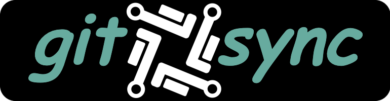

[](https://github.com/aramirol/git-sync/actions/workflows/main.yml)
[](https://github.com/aramirol/git-sync/releases)
[](https://github.com/aramirol/git-sync/blob/main/LICENSE)

Git Sync is a tool that allows you to synchronize `GitHub` repositories with `GitLab`.

## Requirements

Add the following secrets in your `GitHub repository`:

| Name  | Value  |
|:----------|:----------|
| **GITLAB_URL**  | `https://gitlab.com/<<username>>/<<project>>`  |
| **GITLAB_USERNAME**    | `gitlab username`    |
| **GITLAB_TOKEN**   | `gitlab token`    |

Make sure that the remote repository branch is not protected or allows for force push.

## Configure

Use `GitHub Actions` to configure a new `workflow` that sync your GitHub repository to GitLab.

Ensure set up a workflow yourself and copy the following template:

```yml
name: git-sync

on: 
  - push
  - delete

jobs:
  sync:
    runs-on: macos-latest
    name: Git Sync
    steps:
    - uses: actions/checkout@v2
      with:
        fetch-depth: 0
    - uses: aramirol/git-sync@v1.0
      with:
        gitlab-url: ${{ secrets.GITLAB_URL }}
        gitlab-username: ${{ secrets.GITLAB_USERNAME }}
        gitlab-token: ${{ secrets.GITLAB_TOKEN }}

```

## License

MIT License

See [LICENSE](https://github.com/aramirol/git-sync/blob/main/LICENSE) to see the full text.
